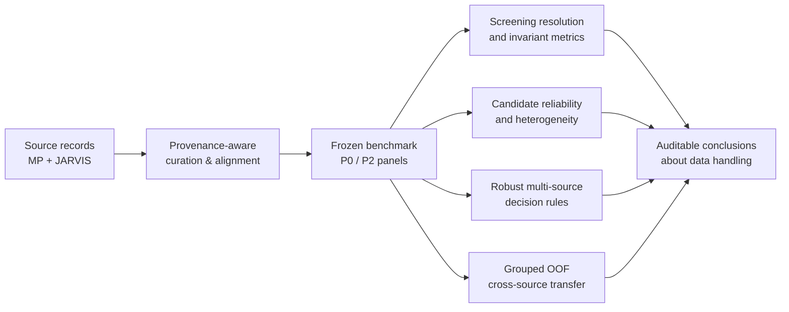

<div align="center">

# CrossPiezo / PULSE

### 面向材料 AI 的来源感知数据整理与跨数据库筛选可靠性研究基础设施

**A provenance-aware framework for reliable and transferable materials screening.**

[](#license--许可)
[](#checks--检查)
[](#benchmark-contract--基准合同)
[](pyproject.toml)

</div>

---

## 项目定位

材料 AI 往往默认不同数据库可以互换使用，但数据清洗、结构对齐、来源处理和评估拆分方式，可能在模型训练之前就改变候选材料的排序与迁移表现。CrossPiezo / PULSE 将这一问题转化为一个可审计的 data-centric benchmark：在固定的跨数据库材料面板上，量化筛选分辨率、候选可靠性、异质性、稳健决策和跨源可迁移性。

The project is a provenance-aware research infrastructure for studying how data curation and source handling shape AI-assisted materials screening. Piezoelectric tensor comparison is the current high-value case study; the methodological target is broader than any single property or database.

## 能力概览

| 能力 | 研究问题 | 当前实现 |
| --- | --- | --- |
| Provenance-aware curation<br>来源感知整理 | 哪些清洗、匹配和表示步骤会改变可比较性？ | 结构匹配、来源条件化记录、匹配分层、数据合同 |
| Screening resolution<br>筛选分辨率 | 全局相关性是否足以保证 elite-tail 可重复？ | 分位数曲线、top-q overlap、rank/tensor invariants |
| Candidate reliability<br>候选可靠性 | 某个材料进入跨源 elite set 的稳定程度如何？ | 条件 grouped bootstrap inclusion probability |
| Disagreement heterogeneity<br>不一致异质性 | 哪些材料特征与跨源不一致相关？ | 分层分析、quantile/OOF 预测和稳健性审查 |
| Robust multi-source screening<br>稳健多源筛选 | 没有 ground truth 时如何做可靠选择？ | balanced-union、worst-source recall、minimax 风险视角 |
| Cross-source transportability<br>跨源可迁移性 | 一个来源训练的模型能否保留另一来源的筛选决策？ | grouped out-of-fold transfer 与 top-q selection diagnostics |

## 研究流程



## 当前研究范围

当前 benchmark 以 Materials Project（MP）与 JARVIS 的结构匹配压电记录为案例，保留 source-conditional values，并在共同坐标约定下进行 tensor-invariant comparison。核心研究链条是：

1. 从 **1,266 个 endpoint overlap records** 建立可追溯的筛选面板；
2. 固定 **573 个 P0 structure-matched pairs**，并保留 **207 个 P2 tight matches** 作为严格敏感性面板；
3. 测量筛选分辨率，而不是用单一 global rank correlation 代替 elite-tail reproducibility；
4. 将可靠性从数据库层面的 overlap 推进到材料层面的 conditional bootstrap probability；
5. 将多源组合表述为预算约束下的 risk-management / decision problem；
6. 用 grouped out-of-fold transfer 检验跨源预测与候选选择的可迁移性。

项目不判断 MP 或 JARVIS 哪一个“更正确”，也不把两者平均值定义为 physical truth。这里的目标是识别 data handling 对筛选结论的影响，并给出在来源不确定性下仍可审计的决策量。

## Benchmark Contract / 基准合同

| Contract item / 合同项 | Frozen definition / 冻结定义 |
| --- | --- |
| Evaluation unit / 评估单位 | Structure-matched MP–JARVIS record pair；chemical formula alone is insufficient |
| P0 panel / P0 面板 | 573 pairs；主分析面板 |
| P2 panel / P2 面板 | 207 tight matches；严格匹配敏感性面板 |
| Primary representation / 主表示 | Cartesian tensor invariants after explicit convention handling |
| Primary resolution view / 主分辨率视角 | Full ranking agreement and elite-tail agreement are reported separately |
| Bootstrap unit / Bootstrap 单位 | Reduced-formula groups；candidate probability is conditional on group presence |
| Primary portfolio example / 主组合示例 | Equal-budget balanced-union with worst-source recall |
| Reproducibility rule / 可复现规则 | Frozen artifacts and versioned scripts are authoritative; prose does not override generated results |

See [`docs/matching_protocol.md`](docs/matching_protocol.md), [`docs/tensor_conventions.md`](docs/tensor_conventions.md), [`docs/statistical_plan.md`](docs/statistical_plan.md), and [`docs/data_contract.md`](docs/data_contract.md) for the detailed contract.

## Evidence boundary / 证据边界

This repository supports conclusions about source-conditional agreement, screening resolution, curation sensitivity, candidate-level reliability, and risk-aware selection on the evaluated benchmark. It does not by itself establish:

- a true tensor, ground-truth consensus, or physical correctness of either source;
- experimental validation or a protocol uncertainty floor;
- generalization beyond the evaluated structure-matched panel;
- an independent third-protocol DFT/DFPT result—the prepared candidate manifest is not an adjudication result.

The full claim policy is maintained in [`docs/claim_boundary.md`](docs/claim_boundary.md).

## Repository map / 仓库导航

- [`docs/PROJECT_GUIDE.md`](docs/PROJECT_GUIDE.md) — active scope, frozen numbers, workflow, and change protocol.
- [`docs/DOCUMENTATION_INDEX.md`](docs/DOCUMENTATION_INDEX.md) — live documentation, evidence, and historical material.
- [`reports/CURRENT_STATUS.md`](reports/CURRENT_STATUS.md) — verification and submission-readiness snapshot.
- [`reports/phase9/01_scientific_upgrade.md`](reports/phase9/01_scientific_upgrade.md) — statistical upgrade and sensitivity report.
- [`docs/claim_boundary.md`](docs/claim_boundary.md) — supported claims and required qualifiers.
- [`src/crosspiezo/`](src/crosspiezo/) — reusable matching, tensor, ranking, and analysis modules.
- [`scripts/`](scripts/) — reproducibility and audit entry points.
- [`tests/`](tests/) — contract and regression tests.

Historical phase material remains under [`archive/`](archive/) for provenance, but it is not an alternative active workflow.

## Quick start / 快速开始

Use a project-specific Python 3.11+ environment; do not install project dependencies into Conda `base`.

```powershell
$env:PYTHONPATH = (Join-Path (Get-Location) 'src')
$env:OMP_NUM_THREADS = '1'
$env:MKL_NUM_THREADS = '1'
$env:OPENBLAS_NUM_THREADS = '1'

python -m pytest -q
python scripts/run_convention_audit.py
python scripts/verify_phase7c.py
```

The frozen Parquet artifacts require `pyarrow>=23.0`. The scientific-upgrade runner writes post-Version-A artifacts under `results/phase9/` and does not overwrite the frozen `results/phase7c/` layer:

```powershell
python scripts/run_scientific_upgrade.py
```

## Checks / 检查

The README badge reports the lightweight targeted contract gate: **26 targeted checks passed**. The repository also keeps broader verification records and known runtime notes in [`reports/CURRENT_STATUS.md`](reports/CURRENT_STATUS.md); use those records when interpreting a full-suite run rather than treating a badge as a substitute for the scientific audit.

Every change to analysis behavior should update the relevant code and tests, regenerate dependent artifacts, inspect the diff, and record the resulting evidence in the current report. Documentation uses Git history and generated provenance instead of manually maintained “last updated” dates.

## License / 许可

Research-use distribution is currently governed by the repository owner. Unless a file states otherwise, the code, frozen artifacts, documentation, and figures are **Research Use Only — All Rights Reserved**. No public redistribution or commercial reuse is granted by this README. See the repository owner for collaboration and licensing terms.

## Citation / 引用

The manuscript and supplementary package are maintained separately from this code repository. Until the archival DOI and final bibliographic metadata are released, please cite the repository as **CrossPiezo / PULSE** and include the commit or artifact manifest used for the analysis.

## Contact

For research collaboration, reproducibility questions, or benchmark-contract changes, open a private issue or contact the repository maintainers. Please include the relevant script, frozen artifact manifest, and commit identifier when reporting a discrepancy.
